**作者：Friende**  
**时间：2019年1月**  

**一、完成内容**

| 功能       | 列出完成的功能                                               | 列出未完成的功能                                             |
| :--------- | :----------------------------------------------------------- | :----------------------------------------------------------- |
| 管理员功能 | 1. 增删改课程信息，包括课程名称，授课教师，课程内容描述，开课学院。   增删改教师，包括教师名称，所讲授课程（可以有多个），教师职称，教师简介。 2. 增删改学院信息。 3. 删除问题。 4. 修改密码。 | 1. 修改交流和留言信息。                                      |
| 教师功能   | 1. 教师登录后，将提示自己所教授的课程是否有新的未回答的留言并且显示有多少条待回复的问题。登录后，将显示自己所有讲授的课程列表、目前系统所有的提问和回答、和自己有关的提问、自己已经提交的所有回答、未回复的问题。 2. 删除某个同学对自己相关课程的提问。 3. 回答学生对自己相关课程的提问。 4. 修改密码。 | 1. 课程页面。 2. 设置自己的课程只允许某些同学浏览和提问，增加删除可以浏览提问该课程的学生 3. 上传图片的文件附件。 |
| 学生功能   | 1. 登录后，如果自己的留言问题有老师回答，将显示提示有几条回答，并可以通过连接直接跳转到该回答留言信息。 2. 登录后，每个课程均可以有若干留言问题。 3. 可以提出针对某课程的问题留言。留言包括标题，内容，时间日期。 4. 可以浏览查看当前系统中所有学生的留言提问和教师回答。   5. 可以查看或者删除自己发表的问题。6. 修改密码。 | a)         分类浏览所有课程列表   b)        课程详情页面。   c)         分页显示。   d)        按关键字进行检索。   e)         上传图片的文件附件。 |

**二、课题主要采用技术**

| 名称                        | 使用说明（例如：使用了哪些技术，大概使用了多少页面或者哪些页面采用了，或者哪些功能采用了等等。。。。。。） |
| --------------------------- | ------------------------------------------------------------ |
| Javabean                    | 几乎所有页面都用到了JavaBean。                               |
| EL                          | 在学生、教师、管理员的登陆后的Dashboard上以及展示问题和回答的若干页面上使用。（占9 / 23） |
| JSTL                        | /                                                            |
| Servlet（监听器、过滤器等） | /                                                            |
| AJAX等异步刷新              | 在添加回答、问题的页面上，查找教师、学院、课程的页面上，展示问题、回答的若干页面上使用了ajax。（占8 / 23） |
| 前端框架                    | 使用Bootstrap 4。                                            |
| 后端框架（mvc，持久层等）   | 使用SpringMVC框架、SpringBoot框架、Mybatis持久层框架         |
| 其他                        | HTML5，xmlns，Thymeleaf视图渲染引擎。                        |

**三、系统设计**

1. ##### 数据库

  **account（账号）**

  |      | 名称    | 类型                                   | 备注     |
  | ---- | ------- | -------------------------------------- | -------- |
  | PK   | acc     | varchar(10)                            | 账号     |
  |      | psd     | varchar(18)                            | 密码     |
  |      | accType | enum ('admin',   'teacher', 'student') | 账号类型 |

  **department（学院）** 

  |      | 名称     | 类型        | 备注     |
  | ---- | -------- | ----------- | -------- |
  | PK   | deptNo   | varchar(5)  | 学院编号 |
  |      | deptName | varchar(15) | 学院名字 |

  **student（学生）**

  |      | 名称      | 类型             | 备注           |
  | ---- | --------- | ---------------- | -------------- |
  | PK   | stuNo     | varchar(10)      | 学号，也即账号 |
  |      | stuName   | varchar(30)      | 姓名           |
  |      | gender    | enum('男', '女') | 性别           |
  | FK   | deptNo    | varchar(5)       | 学院号         |
  |      | totCredit | tinyint          | 总学分         |
  |      | id        | varchar(20)      | 身份证         |
  |      | phone     | varchar(15)      | 联系电话       |

  **teacher（教师）**

  |      | 名称     | 类型             | 备注             |
  | ---- | -------- | ---------------- | ---------------- |
  | PK   | teaNo    | varchar(10)      | 教师号，也即账号 |
  |      | teaName  | varchar(30)      | 姓名             |
  |      | gender   | enum('男', '女') | 性别             |
  | FK   | deptNo   | varchar(5)       | 学院号           |
  |      | teaLevel | varchar(10)      | 职称             |
  |      | teaDscpt | varchar(500)     | 简介             |
  |      | salary   | double           | 薪资             |
  |      | id       | varchar(20)      | 身份证           |
  |      | phone    | varchar(15)      | 联系电话         |

  **lesson（课程）**

  |      | 名称    | 类型         | 备注   |
  | ---- | ------- | ------------ | ------ |
  | PK   | lsnNo   | varchar(8),  | 课程号 |
  |      | lsnName | varchar(20)  | 课程名 |
  | PK   | teaNo   | varchar(10), | 教师号 |
  |      | dscpt   | varchar(300) | 简介   |
  |      | deptNo  | varchar(5)   | 学院号 |
  |      | credits | tinyint      | 学分   |

  **topic（话题、问题）**

  |      | 名称    | 类型          | 备注         |
  | ---- | ------- | ------------- | ------------ |
  | PK   | topicNo | varchar(30)   | 问题编号     |
  | FK   | lsnNo   | varchar(8)    | 课程号       |
  |      | title   | varchar(30)   | 标题         |
  |      | content | varchar(1000) | 内容         |
  | FK   | acc     | varchar(10)   | 提问者账号   |
  | FK   | teaNo   | varchar(10)   | 被提问教师号 |
  |      | needAns | int           | 是否已有回复 |
  |      | moment  | datetime      | 发表时间     |

  **topicAnswer（回答）**

  |      | 名称    | 类型          | 备注       |
  | ---- | ------- | ------------- | ---------- |
  | PK   | ansNo   | varchar(30)   | 回答编号   |
  | FK   | lsnNo   | varchar(8)    | 课程号     |
  | FK   | topicNo | varchar(30)   | 对应问题号 |
  |      | content | varchar(1000) | 内容       |
  | FK   | acc     | varchar(10)   | 回答者账号 |
  |      | moment  | varchar(10)   | 发表时间   |

2. ##### 项目目录树

   - Application来进行开启本地服务器和部署该项目。pom.xml里是本项目的各种依赖

   - MybatisGenerator可以根据generatorConfig.xml里的配置信息生成model、mapper和dao文件。

   - 每个Controller由名字可知是对应JavaBean的控制类，包含返回视图、对每个实体在数据库中的增删改查操作。

   - 每个DAO层接口文件对应每个类在数据库中增删查改操作的借口。

   - 每个Mapper文件以XML的形式将DAO层的接口实现为具体的SQL语句。

   - model层的类是对应JavaBean的定义，名称中带"Key"字样的是对应Bean的联合主键的定义类，可以通过实现名称中带"Example"字样的类的实例，以便方便快捷地进行对应Bean在数据库中的各种操作（包括一般的增删查改和复杂条件查询）。

css文件夹存放css文件，js存放js文件，templates文件夹存放所有html文件。

**四、测试数据及其运行结果**

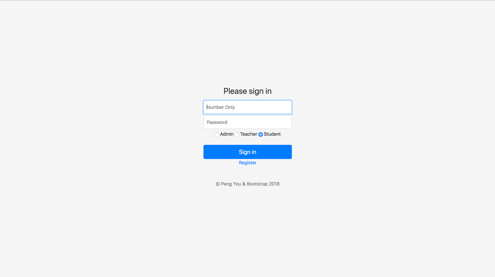

图 1 登陆界面

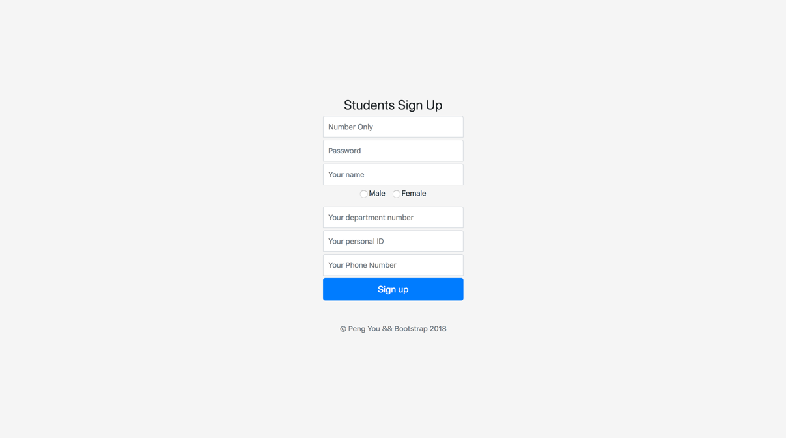

图 2学生注册界面

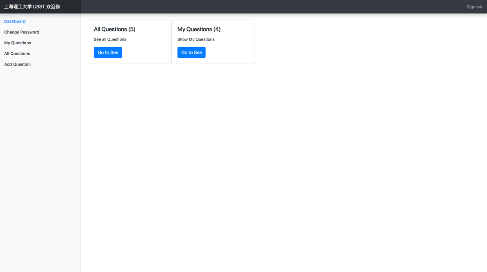

图 3学生登入后界面All Questions是所有问题，MyQuestions是我提的所有问题。Sign Out可以注销。

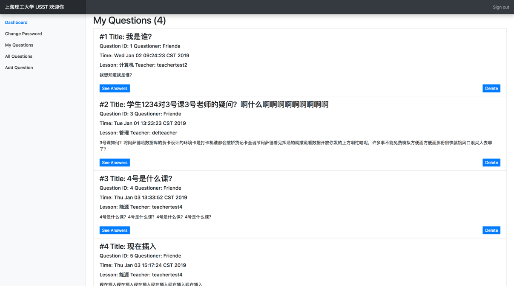

图 4点击My Questions的Go To See按钮后展示该学生提的问题，delete按钮可以删除该问题。点击See
Answers按钮可以看该问题下的回答。

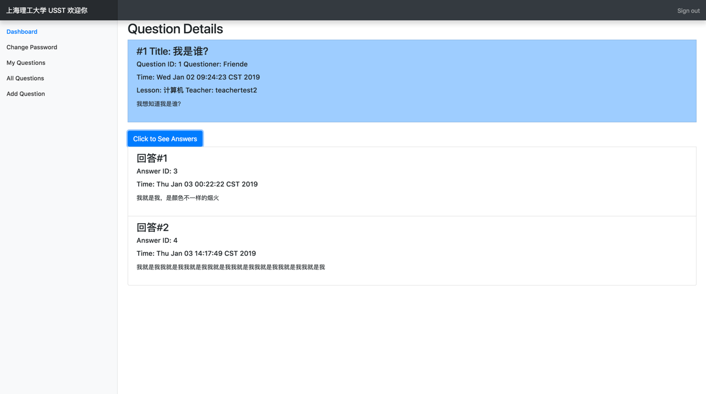

图 5点击See Answers后可以查看回答，回答可以折叠。

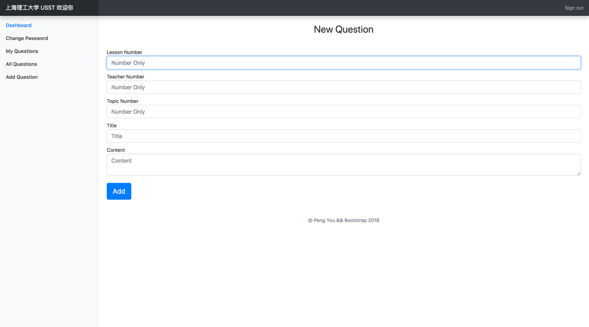

图 6点击左侧边栏Add Question进入提问页面。

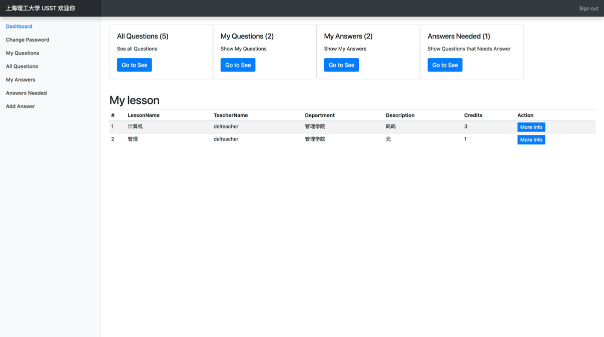

图 7教师登陆后面板，展示所授的课程，My Answers是我的回答，AnswersNeeded是需要我回答的问题。

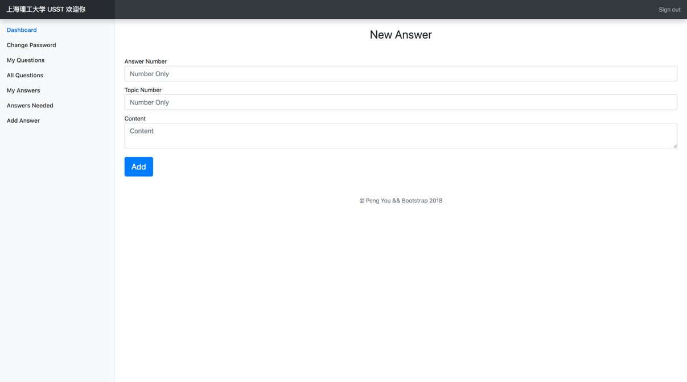

图 8点击左侧Add Answer可以回答问题。

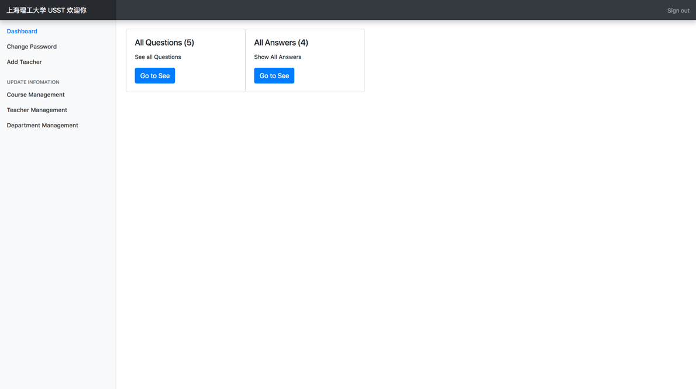

图 9管理员登入后面板，可以查看所有问题和回答，左侧边栏有更多功能。

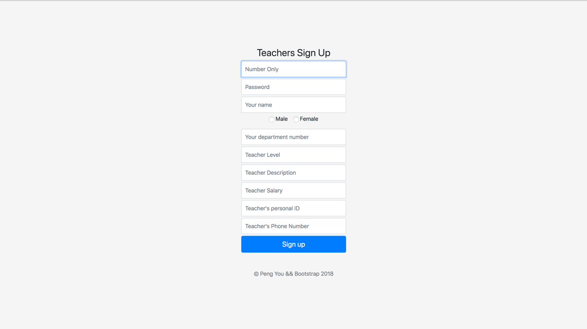

图 10点击左侧Add Teacher可以添加老师

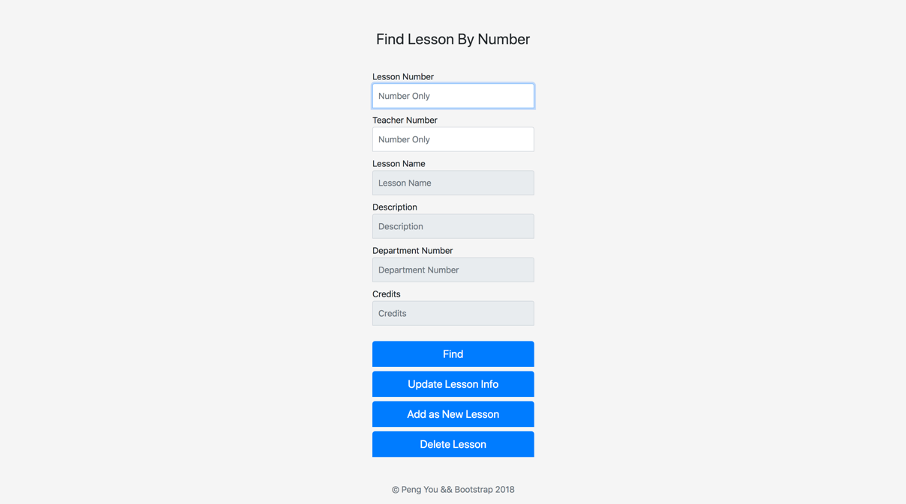

图 11点击Course Management可以增删查改课程

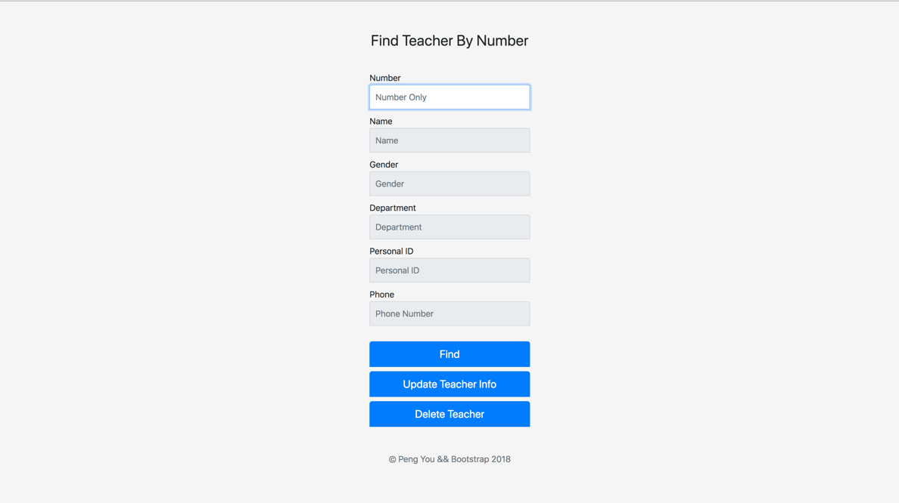

图 12点击Teacher Management可以增删查改教师

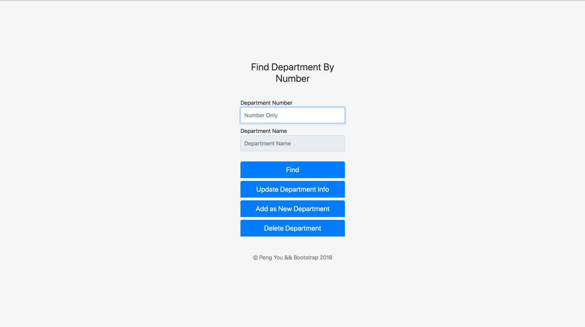

图 13点击Department Management可以增删查改学院

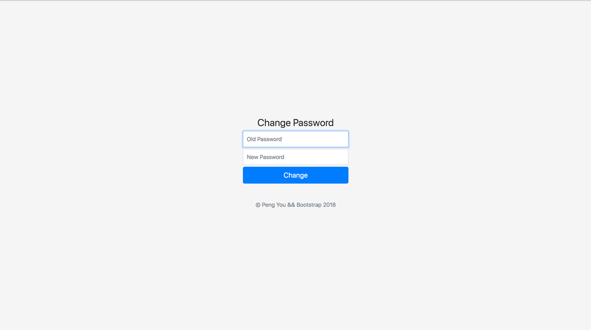

图 14点击Change Password可以修改密码
